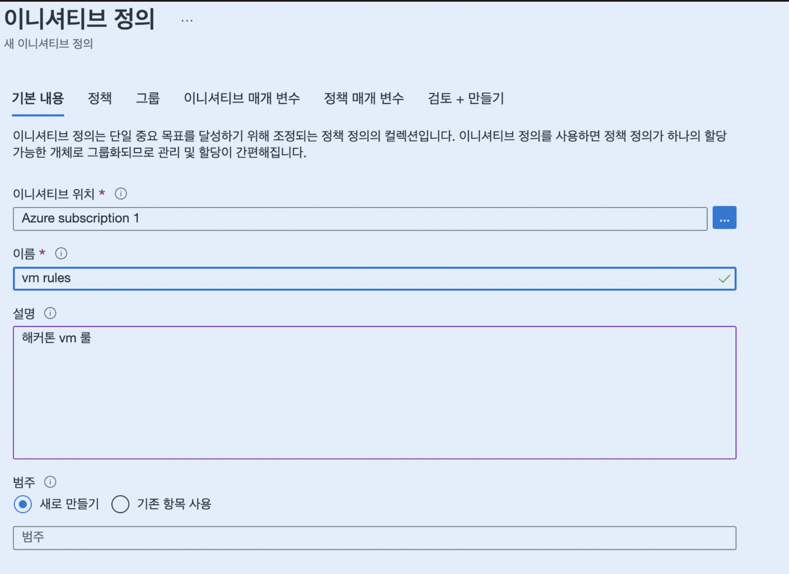
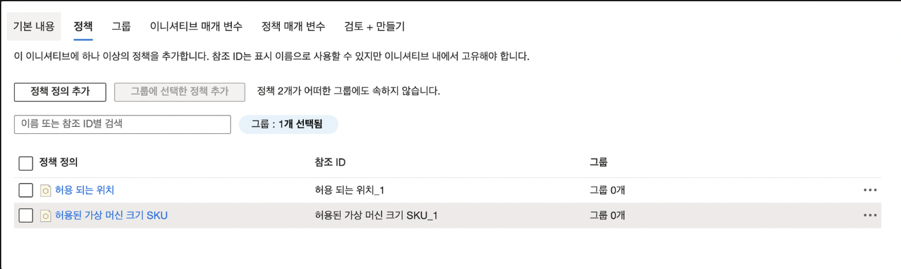

# Azure Policy Concepts

## Definition
- 어떤 자원을 허용하는지 (VM size, ...)

## Initiative
- definition의 논리적인 그룹핑 

## Assignment 
- definition이나 initiative의 범위에 배정하는것(리소스그룹이나 개별 리소스 등등)

## Effect

# 정책 제한 사용하기
## 정책추가 
### 정책 - 정의 - 이니셔티브정의

### 정책 - 정책정의 추가
제한하고싶은 룰 추가 ex) 허용되는 위치, 허용된 가상머신의 크기 sku

### 정책 매개변수에서 값 지정 후 실제 할당은 이니셔티브 할당버튼 클릭
- 실제 할당이 적용되려면 30분정도 걸릴 수 있음.